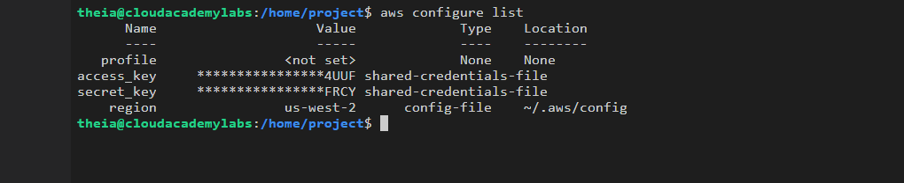
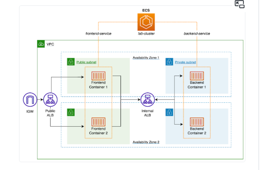
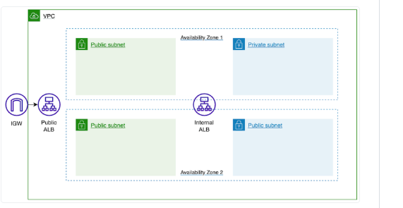
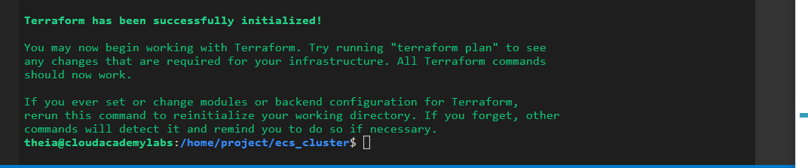
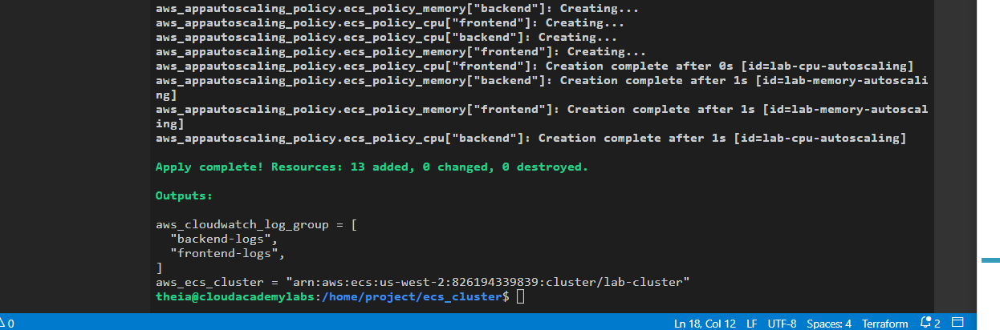
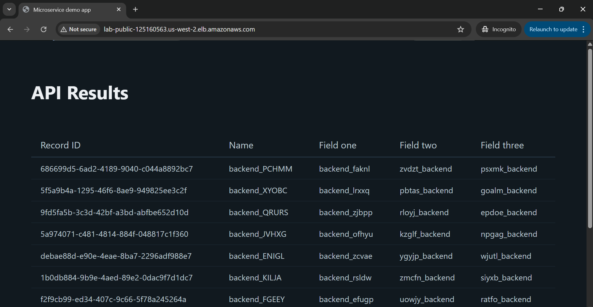

# Provisioning an Amazon ECS Cluster Using Terraform

A hands-on lab walkthrough for provisioning a fully containerised, auto-scaling Amazon ECS Cluster into an existing VPC using **Terraform** — including CloudWatch logging and Auto Scaling Group policies.

---

## Table of Contents

- [Overview](#overview)
- [Architecture](#architecture)
- [Prerequisites](#prerequisites)
- [Lab Steps](#lab-steps)
  - [Step 1 – Configure Terraform AWS Credentials](#step-1--configure-terraform-aws-credentials)
  - [Step 2 – Review Existing AWS Infrastructure](#step-2--review-existing-aws-infrastructure)
  - [Step 3 – Define the ECS Cluster, Services and Task Definitions](#step-3--define-the-ecs-cluster-services-and-task-definitions)
  - [Step 4 – Add CloudWatch Monitoring and Auto Scaling](#step-4--add-cloudwatch-monitoring-and-auto-scaling)
  - [Step 5 – Deploy and Test the ECS Application](#step-5--deploy-and-test-the-ecs-application)
- [Terraform File Structure](#terraform-file-structure)
- [Key Concepts](#key-concepts)
- [Summary](#summary)

---

## Overview

This lab demonstrates how to use a **Terraform module** to provision an Amazon ECS Cluster running two Fargate services — a React-style **frontend** and a data-generating **backend** — within an existing VPC.

**Learning objectives:**

- Define a Terraform module that deploys Amazon ECS resources
- Apply an Auto Scaling Group Policy to respond to ECS metrics
- Deploy an Amazon ECS Cluster into an existing Amazon VPC using Terraform

---

## Architecture

The ECS Cluster is deployed into an existing VPC with the following layout:

```
Internet
    |
Public ALB (port 80)
    |
Frontend ECS Service (Fargate)    <-- public subnets, 2 tasks
    |
Internal ALB
    |
Backend ECS Service (Fargate)     <-- private subnets, 2 tasks
    |
CloudWatch Logs (frontend-logs / backend-logs)
```

### Existing infrastructure (pre-provisioned):

| Resource | Details |
|---|---|
| VPC | 1 VPC with public and private subnets |
| Public Subnets | 2 subnets for the frontend service |
| Private Subnets | 2 subnets for the backend service |
| Public ALB | Serves the frontend application to the internet |
| Internal ALB | Routes traffic from frontend to backend internally |



---

## Prerequisites

- AWS credentials with permissions to provision ECS, IAM, CloudWatch, and Auto Scaling resources
- Terraform installed in your lab IDE
- Existing VPC, subnets, security groups, ALBs, and target groups (pre-provisioned in this lab)
- ECR images for frontend and backend services already pushed

---

## Lab Steps

### Step 1 – Configure Terraform AWS Credentials

Configure your AWS credentials in the terminal:

```bash
aws configure set aws_access_key_id <YOUR_ACCESS_KEY_ID> && \
aws configure set aws_secret_access_key <YOUR_SECRET_ACCESS_KEY> && \
aws configure set default.region us-west-2
```

Verify the credentials were set correctly:

```bash
aws configure list
```



Initialise the Terraform project:

```bash
cd ecs_cluster && \
terraform init
```



---

### Step 2 – Review Existing AWS Infrastructure

Before defining any resources, review the three Terraform files included in the project:

| File | Purpose |
|---|---|
| `variables.tf` | Declares variable names, descriptions, and data types |
| `terraform.tfvars` | Provides the actual values for each variable |
| `outputs.tf` | Defines outputs after deployment (CloudWatch Log Group names, ECS Cluster ARN) |

The `terraform.tfvars` file is the key configuration file. It contains the values retrieved from the pre-existing infrastructure — subnet IDs, security group IDs, target group ARNs, and ECR image URIs.

---

### Step 3 – Define the ECS Cluster, Services and Task Definitions

#### 3.1 Populate `terraform.tfvars`

Open `terraform.tfvars` and paste in the following configuration:

```hcl
app_name = "lab"

ecs_role_arn = "arn:aws:iam::826194339839:role/lab-ecs-task-execution-role"

ecs_services = {
  frontend = {
    image          = "826194339839.dkr.ecr.us-west-2.amazonaws.com/frontend:1.0.0"
    cpu            = 256
    memory         = 512
    container_port = 8080
    host_port      = 8080
    desired_count  = 2
    is_public      = true
    protocol       = "HTTP"
    auto_scaling = {
      max_capacity       = 3
      min_capacity       = 2
      cpu_threshold      = 50
      memory_threshold   = 50
    }
  }

  backend = {
    image          = "826194339839.dkr.ecr.us-west-2.amazonaws.com/backend:1.0.0"
    cpu            = 256
    memory         = 512
    container_port = 8080
    host_port      = 8080
    desired_count  = 2
    is_public      = false
    protocol       = "HTTP"
    auto_scaling = {
      max_capacity       = 3
      min_capacity       = 2
      cpu_threshold      = 75
      memory_threshold   = 75
    }
  }
}

internal_alb_dns = "internal-lab-internal-1092534540.us-west-2.elb.amazonaws.com"

private_subnet_ids = [
  "subnet-0ee21ee7de6ed6872",
  "subnet-0af1e29b4822f9d67"
]

public_subnet_ids = [
  "subnet-0cb9cbced1e1ba4e9",
  "subnet-0e6ade69a83fcc00e"
]

security_group_ids = [
  "sg-042574bd1f74161e1",
  "sg-07633e35c235fdfde"
]

target_group_arns = {
  backend = {
    arn = "arn:aws:elasticloadbalancing:us-west-2:826194339839:targetgroup/backend-tg/d5c64e9f648165b9"
  }
  frontend = {
    arn = "arn:aws:elasticloadbalancing:us-west-2:826194339839:targetgroup/frontend-tg/040f6f1af43b3777"
  }
}
```

> The `ecs_services` map uses Terraform's `for_each` meta-argument — one service definition templates both frontend and backend, reducing duplication in `main.tf`.

#### 3.2 Add ECS Cluster and Services to `main.tf`

Open `main.tf` and paste in the following resource definitions:

```hcl
resource "aws_ecs_cluster" "ecs_cluster" {
  name = lower("${var.app_name}-cluster")
}

# ECS Services
resource "aws_ecs_service" "service" {
  for_each = var.ecs_services

  name            = "${each.key}-service"
  cluster         = aws_ecs_cluster.ecs_cluster.id
  task_definition = aws_ecs_task_definition.ecs_task_definition[each.key].arn
  launch_type     = "FARGATE"
  desired_count   = each.value.desired_count

  network_configuration {
    subnets          = each.value.is_public == true ? var.public_subnet_ids : var.private_subnet_ids
    assign_public_ip = each.value.is_public
    security_groups  = var.security_group_ids
  }

  load_balancer {
    target_group_arn = var.target_group_arns[each.key].arn
    container_name   = each.key
    container_port   = each.value.container_port
  }
}
```

**How this works:**

- `for_each = var.ecs_services` iterates over the `ecs_services` map, creating one `aws_ecs_service` resource per entry (`frontend` and `backend`)
- `each.key` resolves to the service name (`frontend` or `backend`)
- `each.value.is_public` determines whether the service is deployed into public or private subnets
- The `load_balancer` block associates each service with the correct ALB target group

#### 3.3 Add the ECS Task Definition

Continue adding the task definition to `main.tf`. The `aws_ecs_task_definition` resource defines the containers within each service, including:

- The **ECR image** to pull
- **CPU and memory** allocation
- **Environment variables** passed into each container
- **Port mappings** so containers can send and receive traffic on port 8080
- **Log configuration** using the `awslogs` driver to send container logs to CloudWatch Logs

---

### Step 4 – Add CloudWatch Monitoring and Auto Scaling

Append the following resources to `main.tf`:

```hcl
# CloudWatch Log Groups
resource "aws_cloudwatch_log_group" "ecs_cw_log_group" {
  for_each = toset(keys(var.ecs_services))
  name     = lower("${each.key}-logs")
}

# ECS Auto Scaling Target
resource "aws_appautoscaling_target" "service_autoscaling" {
  for_each = var.ecs_services

  max_capacity       = each.value.auto_scaling.max_capacity
  min_capacity       = each.value.auto_scaling.min_capacity
  resource_id        = "service/${aws_ecs_cluster.ecs_cluster.name}/${aws_ecs_service.service[each.key].name}"
  scalable_dimension = "ecs:service:DesiredCount"
  service_namespace  = "ecs"
}

# Auto Scaling Policy: Memory
resource "aws_appautoscaling_policy" "ecs_policy_memory" {
  for_each = var.ecs_services

  name               = "${var.app_name}-memory-autoscaling"
  policy_type        = "TargetTrackingScaling"
  resource_id        = aws_appautoscaling_target.service_autoscaling[each.key].resource_id
  scalable_dimension = aws_appautoscaling_target.service_autoscaling[each.key].scalable_dimension
  service_namespace  = aws_appautoscaling_target.service_autoscaling[each.key].service_namespace

  target_tracking_scaling_policy_configuration {
    predefined_metric_specification {
      predefined_metric_type = "ECSServiceAverageMemoryUtilization"
    }
    target_value = each.value.auto_scaling.memory_threshold
  }
}

# Auto Scaling Policy: CPU
resource "aws_appautoscaling_policy" "ecs_policy_cpu" {
  for_each = var.ecs_services

  name               = "${var.app_name}-cpu-autoscaling"
  policy_type        = "TargetTrackingScaling"
  resource_id        = aws_appautoscaling_target.service_autoscaling[each.key].resource_id
  scalable_dimension = aws_appautoscaling_target.service_autoscaling[each.key].scalable_dimension
  service_namespace  = aws_appautoscaling_target.service_autoscaling[each.key].service_namespace

  target_tracking_scaling_policy_configuration {
    predefined_metric_specification {
      predefined_metric_type = "ECSServiceAverageCPUUtilization"
    }
    target_value = each.value.auto_scaling.cpu_threshold
  }
}
```

**What each resource does:**

| Resource | Purpose |
|---|---|
| `aws_cloudwatch_log_group` | Creates `frontend-logs` and `backend-logs` log groups in CloudWatch |
| `aws_appautoscaling_target` | Sets the min (2) and max (3) task count per service |
| `aws_appautoscaling_policy` (memory) | Scales tasks out when average memory exceeds the threshold |
| `aws_appautoscaling_policy` (cpu) | Scales tasks out when average CPU exceeds the threshold |

**Auto Scaling thresholds by service:**

| Service | CPU threshold | Memory threshold |
|---|---|---|
| Frontend | 50% | 50% |
| Backend | 75% | 75% |

---

### Step 5 – Deploy and Test the ECS Application

#### 5.1 Validate the Plan

Run `terraform plan` and save the output for review:

```bash
terraform plan -no-color > plan.txt
```

This validates the configuration and outputs a summary of the **13 resources** that will be created. Review `plan.txt` to confirm all values have resolved correctly from `terraform.tfvars`.

#### 5.2 Deploy the Cluster

```bash
terraform apply --auto-approve
```



Terraform will provision all 13 resources including the ECS Cluster, two ECS Services, two Task Definitions, CloudWatch Log Groups, and Auto Scaling policies.



#### 5.3 Test the Application

Once the deployment completes, open the public ALB URL in your browser:

```
lab-public-125160563.us-west-2.elb.amazonaws.com
```



The application is a simple **API Results** webpage. Each time you refresh the page, the frontend ECS tasks retrieve a new set of data from the backend tasks and display it in a table organised by Record ID.

> Each page refresh triggers a new request from the frontend service through the internal ALB to the backend service, demonstrating the full service-to-service communication within the cluster.

---

## Terraform File Structure

```
ecs_cluster/
├── main.tf             # ECS Cluster, Services, Task Definitions, CloudWatch, Auto Scaling
├── variables.tf        # Variable declarations (names, types, descriptions)
├── terraform.tfvars    # Variable values (subnet IDs, image URIs, ARNs, etc.)
└── outputs.tf          # Outputs: CloudWatch Log Group names, ECS Cluster ARN
```

---

## Key Concepts

**`for_each` meta-argument** — Used throughout `main.tf` to iterate over the `ecs_services` map. A single resource block templates both the frontend and backend services, reducing duplication.

**`is_public` attribute** — Controls subnet placement and public IP assignment. Frontend tasks are placed in public subnets with public IPs; backend tasks are in private subnets with no public access.

**Fargate launch type** — All tasks use AWS Fargate, meaning there are no EC2 instances to manage. AWS handles the underlying compute.

**Target Tracking Scaling** — Auto Scaling policies use `TargetTrackingScaling` to automatically adjust task count when CPU or memory metrics cross the configured threshold.

**Headless ALB routing** — The frontend communicates with the backend via the internal ALB DNS name passed as an environment variable — not directly pod-to-pod.

---

## Summary

By completing this lab, you have:

- Defined a **Terraform module** that deploys an Amazon ECS Cluster, two Fargate services, and task definitions using `for_each` to template resources efficiently
- Configured **CloudWatch Log Groups** to capture container logs from both services
- Applied **Auto Scaling Group policies** tracking CPU and memory metrics to automatically scale ECS tasks within defined min/max bounds
- Deployed and tested the full application via the **public ALB URL**

---

## Tools Used


